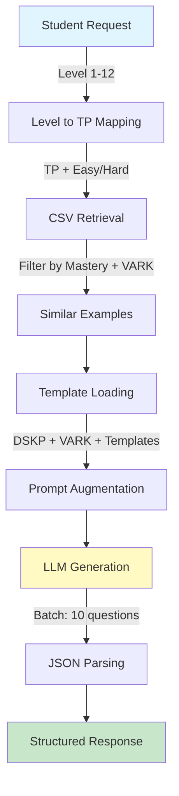
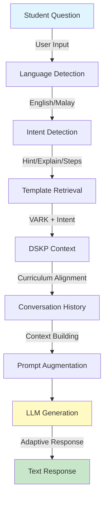

# 🧮 MathGenX RAG - Dual RAG Architecture for Mathematics Education

A **Dual Retrieval-Augmented Generation (RAG)** system for Malaysian Form 1 mathematics education, featuring two independent RAG systems: **Question Generation RAG** for creating personalized practice questions and **Chatbot RAG** for providing adaptive student assistance.

[](https://www.python.org/)
[](https://fastapi.tiangolo.com/)
[](https://ai.google.dev/)

---

## 🎯 Overview

MathGenX RAG implements **two separate RAG systems** with distinct roles:

1. **Question Generation RAG** (`rag_core/`): Generates NEW personalized math questions
2. **Chatbot RAG** (`rag_chatbot/`): Provides adaptive help for students working on EXISTING questions

Both systems use the same LLM provider abstraction layer but can be configured to use different providers (Gemini or Anthropic Claude) independently.

---

## 🏗️ Dual RAG Architecture

### System 1: Question Generation RAG

**Purpose**: Generate new personalized mathematics questions for practice

**Data Source**: CSV dataset (`assessment_content.csv`) with 96 curriculum-aligned questions

**Flow**:


**Key Features**:
- **Level-based System**: Levels 1-12 map to TP with easy/hard distribution
- **Batch Generation**: Single API call generates 10 questions (7 easy + 3 hard or 3 easy + 7 hard)
- **Word Limits**: TP-based constraints (TP1: 30 words, TP6: 60 words)
- **CSV Retrieval**: Retrieves similar examples from 96-question dataset
- **Multi-format**: Supports multiple choice and subjective formats

### System 2: Chatbot RAG

**Purpose**: Provide adaptive help for students working on existing questions

**Data Source**: Answer templates (`answer_templates.json`) + DSKP context

**Flow**:


**Key Features**:
- **Intent Detection**: Automatically detects if student needs hint, explanation, or step-by-step
- **Language Auto-detection**: Responds in same language as student input
- **Conversation History**: Maintains context across multiple interactions
- **VARK Adaptation**: Tailors responses to student's learning style
- **Decision Rules**: Intelligently decides when to give answer vs. guide

---

## 📊 System Comparison

| Aspect | Question Generation RAG | Chatbot RAG |
|--------|-------------------------|-------------|
| **Role** | Create new questions | Help with existing questions |
| **Primary Data** | CSV examples (96 questions) | Answer templates + DSKP |
| **Retrieval Focus** | Similar question examples | Curriculum context + help styles |
| **Output** | Structured question JSON | Conversational text response |
| **Context** | Topic, subtopic, mastery level | Current question + conversation history |
| **Intent** | Generate appropriate question | Detect student's help need |
| **Language** | Configurable (English/Malay) | Auto-detected from user input |
| **Endpoint** | `/api/rag-generate` | `/api/chatbot-help` |
| **Provider** | LLM Provider (Gemini/Claude) | LLM Provider (Gemini/Claude) |

---

## 📁 Project Structure

```
mathgenx-ai-prototype/
│
├── app.py                          # FastAPI application (both endpoints)
├── start_server.sh                 # Server startup script
├── requirements.txt                # Python dependencies
│
├── rag_core/                       # Question Generation RAG
│   ├── __init__.py
│   ├── retriever.py               # CSV retrieval + JSON loading
│   ├── generator.py               # Batch generation logic
│   ├── llm_provider.py            # LLM provider abstraction
│   └── test-generator.py          # Standalone test script
│
├── rag_chatbot/                    # Chatbot RAG
│   ├── __init__.py
│   └── chatbot_engine.py          # Chatbot logic + intent detection
│
├── knowledge_base/                 # Configuration & templates (JSON)
│   ├── question_templates.json    # Question generation rules
│   ├── answer_templates.json      # Chatbot help styles (VARK + intent)
│   ├── dskp_F1_T1_mastery.json   # DSKP mastery level definitions
│   └── vark_templates.json        # VARK learning style constraints
│
├── data/                           # Question Generation RAG Dataset
│   └── assessment_content.csv     # 96 curriculum-aligned questions
│
├── test/                           # Test scripts
│   ├── test_rag_complete.py       # Question generation test
│   ├── test_provider_switch.py    # Provider switching test
│   └── test_json_response.py      # JSON parsing test
│
└── md/                             # Documentation
    ├── API_JSON_RESPONSE.md
    ├── DSKP_MASTERY_SYSTEM.md
    └── QUESTION_STYLE_CUSTOMIZATION.md
```

---

## 🚀 Quick Start

### **1. Prerequisites**

- Python 3.12+
- LLM API Key (Gemini or Anthropic Claude)
- Virtual environment (recommended)

### **2. Installation**

```bash
# Clone repository
git clone https://github.com/camikemal/MathGenX-Ai.git
cd MathGenX-Ai

# Create virtual environment
python3 -m venv venv_mathgenx
source venv_mathgenx/bin/activate  # On macOS/Linux
# venv_mathgenx\Scripts\activate   # On Windows

# Install dependencies
pip install -r requirements.txt
```

### **3. Configuration**

Create `.env` file in project root:

**Option A: Using Gemini (Default)**
```env
LLM_PROVIDER=gemini
GEMINI_API_KEY=your_gemini_api_key_here
GEMINI_MODEL=gemini-3-flash-preview  # Optional, defaults to gemini-2.5-flash
```

**Option B: Using Anthropic (Claude)**
```env
LLM_PROVIDER=anthropic
ANTHROPIC_API_KEY=your_anthropic_api_key_here
ANTHROPIC_MODEL=claude-sonnet-4-5  # Optional, defaults to claude-sonnet-4-5
```

**Note**: Both RAG systems use the same provider by default, but the abstraction layer allows independent configuration if needed.

### **4. Start Server**

**Option A: Using start script (Recommended)**
```bash
chmod +x start_server.sh
./start_server.sh
```

**Option B: Manual start**
```bash
source venv_mathgenx/bin/activate
uvicorn app:app --host 0.0.0.0 --port 8000 --reload
```

Server will start at:
- **API Endpoints**: 
  - Question Generation: `http://localhost:8000/api/rag-generate`
  - Chatbot Help: `http://localhost:8000/api/chatbot-help`
- **Interactive Docs**: `http://localhost:8000/docs`

---

## 📡 API Documentation

### **Endpoint 1: Question Generation RAG**

**POST** `/api/rag-generate`

Generates 10 personalized math questions in a single API call using batch generation.

#### **Request Body**

```json
{
  "topic": "1",
  "subtopic": "1.1",
  "level": 5,
  "question_format": "multiple_choice",
  "vark_style": "Visual",
  "language": "english"
}
```

#### **Parameters**

| Parameter | Type | Required | Description |
|-----------|------|----------|-------------|
| `topic` | string | ✅ | Topic identifier (e.g., "1" or "Topic1") |
| `subtopic` | string | ❌ | Subtopic code (e.g., "1.1", "1.2") |
| `level` | integer | ✅ | Level 1-12 (maps to TP with easy/hard) |
| `question_format` | string | ❌ | `multiple_choice` or `subjective` (default: `multiple_choice`) |
| `vark_style` | string | ✅ | `Visual`, `Read`, `Auditory`, `Kinesthetic` |
| `language` | string | ❌ | `english` or `malay` (default: `english`) |

#### **Level System**

Levels 1-12 map to TP (Teaching Point) with easy/hard distribution:

| Level | TP | Distribution | Total Questions |
|-------|----|----|-----------------|
| 1 | TP1 | 7 easy + 3 hard | 10 |
| 2 | TP1 | 3 easy + 7 hard | 10 |
| 3 | TP2 | 7 easy + 3 hard | 10 |
| 4 | TP2 | 3 easy + 7 hard | 10 |
| 5 | TP3 | 7 easy + 3 hard | 10 |
| 6 | TP3 | 3 easy + 7 hard | 10 |
| 7 | TP4 | 7 easy + 3 hard | 10 |
| 8 | TP4 | 3 easy + 7 hard | 10 |
| 9 | TP5 | 7 easy + 3 hard | 10 |
| 10 | TP5 | 3 easy + 7 hard | 10 |
| 11 | TP6 | 7 easy + 3 hard | 10 |
| 12 | TP6 | 3 easy + 7 hard | 10 |

**Word Limits per TP**:
- TP1: 30 words (easiest - keep simple)
- TP2: 35 words
- TP3: 45 words
- TP4: 50 words
- TP5: 55 words
- TP6: 60 words (hardest - can be more detailed)

#### **Response Example**

```json
{
  "success": true,
  "data": {
    "questions": [
      {
        "id": 1,
        "question_text": "Ali has 3/4 kg of flour. He uses 1/3 kg to bake a cake. How much flour is left?",
        "choices": [
          {"id": 1, "label": "A", "text": "1/12 kg"},
          {"id": 2, "label": "B", "text": "5/12 kg"},
          {"id": 3, "label": "C", "text": "7/12 kg"},
          {"id": 4, "label": "D", "text": "11/12 kg"}
        ],
        "answer_key": "B",
        "topic_id": "Topic1",
        "subtopic_id": "1.1",
        "mastery_level": "TP3_easy",
        "learning_style": "Visual",
        "question_format": "multiple_choice"
      }
      // ... 9 more questions
    ],
    "metadata": {
      "topic": "Topic1",
      "subtopic": "1.1",
      "level": 5,
      "mastery_level": "TP3 (7 easy + 3 hard)",
      "tp_number": 3,
      "easy_count": 7,
      "hard_count": 3,
      "learning_style": "Visual",
      "question_format": "multiple_choice",
      "language": "english",
      "total_generated": 10,
      "total_requested": 10,
      "api_calls": 1
    }
  },
  "message": "Successfully generated 10 out of 10 questions in 1 API call"
}
```

---

### **Endpoint 2: Chatbot RAG**

**POST** `/api/chatbot-help`

Provides adaptive help for students working on existing questions.

#### **Request Body**

```json
{
  "practice_session_id": "abc-123",
  "vark_style": "Visual",
  "question": "Calculate: 5 + (-3)",
  "answer": "2",
  "user_prompt": "I don't understand how to solve this",
  "topic": "1",
  "subtopic": "1.1",
  "chat_history": [
    {"role": "user", "content": "I'm stuck"},
    {"role": "assistant", "content": "Let's look at the number line..."}
  ]
}
```

#### **Parameters**

| Parameter | Type | Required | Description |
|-----------|------|----------|-------------|
| `practice_session_id` | string | ✅ | Practice session identifier |
| `vark_style` | string | ✅ | `Visual`, `Read`, `Auditory`, `Kinesthetic` |
| `question` | string | ✅ | The current question student is working on |
| `answer` | string | ✅ | Correct answer (for reference, not shown to student) |
| `user_prompt` | string | ✅ | Student's request for help |
| `topic` | string | ✅ | Topic identifier (e.g., "1" or "Topic1") |
| `subtopic` | string | ❌ | Subtopic code (e.g., "1.1", "1.2") |
| `chat_history` | array | ❌ | Conversation history (managed by Laravel) |

#### **Intent Detection**

The chatbot automatically detects student intent from keywords:

- **Hint**: "hint", "clue", "tip", "stuck", "don't know how to begin"
- **Explanation**: "explain", "why", "what does this mean", "understand"
- **Step-by-step**: "show me steps", "how to solve", "walk me through"

#### **Language Detection**

Automatically detects language from user input and responds in the same language (English or Malay).

#### **Response Example**

```json
{
  "success": true,
  "data": {
    "response": "Think of the number line. Start at 5, then move 3 steps to the left (negative direction). You'll land at 2.",
    "language": "english",
    "intent": "explanation",
    "metadata": {
      "practice_session_id": "abc-123",
      "topic": "Topic1",
      "subtopic": "1.1",
      "vark_style": "Visual"
    }
  },
  "message": "Response generated successfully"
}
```

---

## 🔍 RAG System Details

### **Question Generation RAG Process**

1. **Retrieval** (`rag_core/retriever.py`):
   - Loads CSV dataset (`assessment_content.csv`)
   - Filters by mastery level (TP1-TP6) and VARK style (R, V, A, K)
   - Retrieves 2-3 similar examples for style reference
   - Loads DSKP context, VARK templates, and question templates

2. **Augmentation** (`rag_core/generator.py`):
   - Combines retrieved examples with curriculum context
   - Adds subtopic-specific instructions
   - Applies word limits based on TP level
   - Builds enriched prompt with all constraints

3. **Generation**:
   - Single LLM API call generates 10 questions (batch)
   - Questions follow retrieved examples' style
   - Respects word limits and curriculum standards

4. **Parsing**:
   - Parses LLM response into structured JSON
   - Validates format (multiple choice or subjective)
   - Extracts answers, choices, and working steps

### **Chatbot RAG Process**

1. **Language Detection** (`rag_chatbot/chatbot_engine.py`):
   - Analyzes user input for Malay/English indicators
   - Sets response language accordingly

2. **Intent Detection**:
   - Matches keywords to determine help type
   - Categories: hint, explanation, or step-by-step

3. **Retrieval**:
   - Loads answer templates (`answer_templates.json`)
   - Retrieves VARK-specific help style
   - Gets DSKP context for curriculum alignment

4. **Augmentation**:
   - Combines current question, correct answer, conversation history
   - Applies VARK-specific response style
   - Adds intent-based guidance format

5. **Generation**:
   - LLM generates adaptive response (30-50 words)
   - Follows decision rules (when to give answer vs. guide)
   - Maintains conversation context

---

## 📊 Data Sources

### **CSV Dataset** (`data/assessment_content.csv`)

Used by **Question Generation RAG** for retrieving similar examples.

- **Size**: 96 curriculum-aligned questions
- **Structure**:
  - `question_text`: The actual question
  - `answer`: Correct answer
  - `calculation_step`: Working/solution steps
  - `mastery_id`: Mastery level (TP1-TP6)
  - `learning_type`: VARK style (R, V, A, K)
  - `criteria_id`: Curriculum criteria (1.1.1)
  - `example`: Context category (e.g., "Suhu", "Lif")

- **Distribution**: Questions across all TP levels and VARK styles

### **Answer Templates** (`knowledge_base/answer_templates.json`)

Used by **Chatbot RAG** for VARK-specific help styles.

- **VARK Styles**: Visual, Read, Auditory, Kinesthetic
- **Intent Types**: Hint, Explanation, Step-by-step
- **Keywords**: Intent detection patterns
- **Guidelines**: Response rules and best practices

---

## 🎓 Mastery Levels (DSKP)

| Level | Code | Description | Complexity | Word Limit |
|-------|------|-------------|------------|------------|
| **TP1** | Basic Recognition | Identify, name, recognize | Single-step | 30 words |
| **TP2** | Understanding | Explain, order, compare | 1-2 steps | 35 words |
| **TP3** | Application | Calculate, apply operations | Multi-step | 45 words |
| **TP4** | Analysis | Solve word problems | 2-3 steps | 50 words |
| **TP5** | Evaluation | Complex multi-step problems | 3-5 steps | 55 words |
| **TP6** | Creation | Non-routine, creative thinking | Multiple steps | 60 words |

---

## 🎨 VARK Learning Styles

| Style | Characteristics | Question Adaptation | Chatbot Adaptation |
|-------|----------------|---------------------|-------------------|
| **Visual** | Learns through images, diagrams | Spatial relationships, positions | Visual descriptions, spatial analogies |
| **Read** | Learns through text | Clear written instructions | Formal definitions, structured text |
| **Auditory** | Learns through listening | Conversational, story-based | Dialogue, verbal descriptions |
| **Kinesthetic** | Learns through doing | Hands-on scenarios, real-world | Physical actions, movements |

---

## 🤖 LLM Provider Configuration

Both RAG systems use the same provider abstraction layer (`rag_core/llm_provider.py`), allowing easy switching between providers.

### **Supported Providers**

- **Google Gemini** (default): `gemini-2.5-flash` or `gemini-3-flash-preview`
- **Anthropic Claude**: `claude-sonnet-4-5`

### **Configuration**

Environment variables in `.env`:
```env
LLM_PROVIDER=gemini                    # or anthropic
GEMINI_API_KEY=your_key_here
GEMINI_MODEL=gemini-3-flash-preview   # Optional
ANTHROPIC_API_KEY=your_key_here
ANTHROPIC_MODEL=claude-sonnet-4-5     # Optional
```

### **Provider Features**

- **Automatic Fallback**: If primary provider fails, automatically tries the other
- **Retry Logic**: Exponential backoff for transient errors (500/503/429)
- **Temperature**: 0.7 (balanced creativity)
- **Max Tokens**: 
  - Question Generation: Up to 8192 (batch)
  - Chatbot: 1024 (concise responses)

### **Switching Providers**

1. Edit `.env` file: `LLM_PROVIDER=gemini` or `LLM_PROVIDER=anthropic`
2. Set corresponding API key
3. Optionally set model name
4. Restart server: `./start_server.sh`

---

## 🧪 Testing

### **Test Question Generation RAG**

```bash
python test/test_rag_complete.py
```

Tests:
- ✅ CSV data retrieval
- ✅ Example filtering by mastery level and VARK style
- ✅ Batch generation (10 questions)
- ✅ JSON parsing

### **Test with cURL**

**Question Generation**:
```bash
curl -X POST http://localhost:8000/api/rag-generate \
  -H "Content-Type: application/json" \
  -d '{
    "topic": "1",
    "level": 5,
    "vark_style": "Visual",
    "question_format": "multiple_choice"
  }'
```

**Chatbot Help**:
```bash
curl -X POST http://localhost:8000/api/chatbot-help \
  -H "Content-Type: application/json" \
  -d '{
    "practice_session_id": "test-123",
    "vark_style": "Visual",
    "question": "Calculate: 5 + (-3)",
    "answer": "2",
    "user_prompt": "I need help",
    "topic": "1"
  }'
```

### **Test Provider Switching**

```bash
python test/test_provider_switch.py
```

---

## 🔗 Laravel Integration

### **Question Generation**

```php
<?php

namespace App\Http\Controllers;

use Illuminate\Http\Request;
use Illuminate\Support\Facades\Http;

class QuestionGeneratorController extends Controller
{
    public function generate(Request $request)
    {
        $response = Http::timeout(60)->post('http://localhost:8000/api/rag-generate', [
            'topic' => $request->topic,
            'subtopic' => $request->subtopic,
            'level' => $request->level,
            'question_format' => $request->question_format ?? 'multiple_choice',
            'vark_style' => $request->vark_style,
            'language' => $request->language ?? 'english',
        ]);

        return $response->json();
    }
}
```

### **Chatbot Help**

```php
public function chatbotHelp(Request $request)
{
    $response = Http::timeout(30)->post('http://localhost:8000/api/chatbot-help', [
        'practice_session_id' => $request->practice_session_id,
        'vark_style' => $request->vark_style,
        'question' => $request->question,
        'answer' => $request->answer,
        'user_prompt' => $request->user_prompt,
        'topic' => $request->topic,
        'subtopic' => $request->subtopic,
        'chat_history' => $request->chat_history ?? [],
    ]);

    return $response->json();
}
```

---

## 📈 Performance

| Metric | Question Generation RAG | Chatbot RAG |
|--------|------------------------|-------------|
| Response Time | 10-20 seconds (batch) | 2-5 seconds |
| API Calls | 1 call for 10 questions | 1 call per request |
| Concurrent Requests | Multiple (async) | Multiple (async) |
| Success Rate | ~95% | ~95% |

---

## 🛠️ Troubleshooting

### **Server won't start**

```bash
# Check if port 8000 is in use
lsof -i :8000

# Kill process if needed
kill -9 <PID>
```

### **LLM Provider errors**

```bash
# Check which provider is configured
python test/test_provider_switch.py

# Check API key
cat .env | grep API_KEY
```

### **Empty responses from AI**

- Check internet connection
- Verify API key is valid
- Check API quota (Gemini free tier: 15 RPM)
- Review error messages in server logs

### **Question Generation Issues**

- Verify CSV dataset exists: `data/assessment_content.csv`
- Check mastery level format (TP1-TP6)
- Verify VARK style matches CSV learning_type (R, V, A, K)

### **Chatbot Issues**

- Verify answer templates exist: `knowledge_base/answer_templates.json`
- Check conversation history format (array of {role, content})
- Review intent detection keywords

---

## 📝 Development

### **Add New Questions to Dataset**

1. Add questions to `data/assessment_content.csv`
2. Include: mastery_id, learning_type, question_text, answer
3. Questions will be automatically retrieved by Question Generation RAG

### **Modify Chatbot Response Styles**

1. Edit `knowledge_base/answer_templates.json`
2. Update VARK-specific styles or intent keywords
3. Restart server to load changes

### **Add New Topic**

1. Add topic to `knowledge_base/question_templates.json`
2. Add questions to CSV dataset
3. Update DSKP definitions if needed

---

## 🔐 Security

- ✅ API keys stored in `.env` (not in Git)
- ✅ CORS enabled for Laravel integration
- ✅ Input validation with Pydantic
- ✅ Error handling for all API calls

**Production Checklist**:
- [ ] Change CORS origins to specific domain
- [ ] Add rate limiting
- [ ] Use HTTPS
- [ ] Add authentication
- [ ] Monitor API usage

---

## 🤝 Contributing

1. Fork the repository
2. Create feature branch (`git checkout -b feature/AmazingFeature`)
3. Commit changes (`git commit -m 'Add AmazingFeature'`)
4. Push to branch (`git push origin feature/AmazingFeature`)
5. Open Pull Request

---

## 📄 License

This project is licensed under the MIT License.

---

## 👨‍💻 Author

**Camikemal**
- GitHub: [@camikemal](https://github.com/camikemal)
- Repository: [MathGenX-Ai](https://github.com/camikemal/MathGenX-Ai)

---

## 🙏 Acknowledgments

- Malaysian Ministry of Education (DSKP Curriculum)
- Google Gemini AI Platform
- Anthropic Claude AI Platform
- FastAPI Framework
- VARK Learning Styles Model

---

**Made with ❤️ for Malaysian Education**
